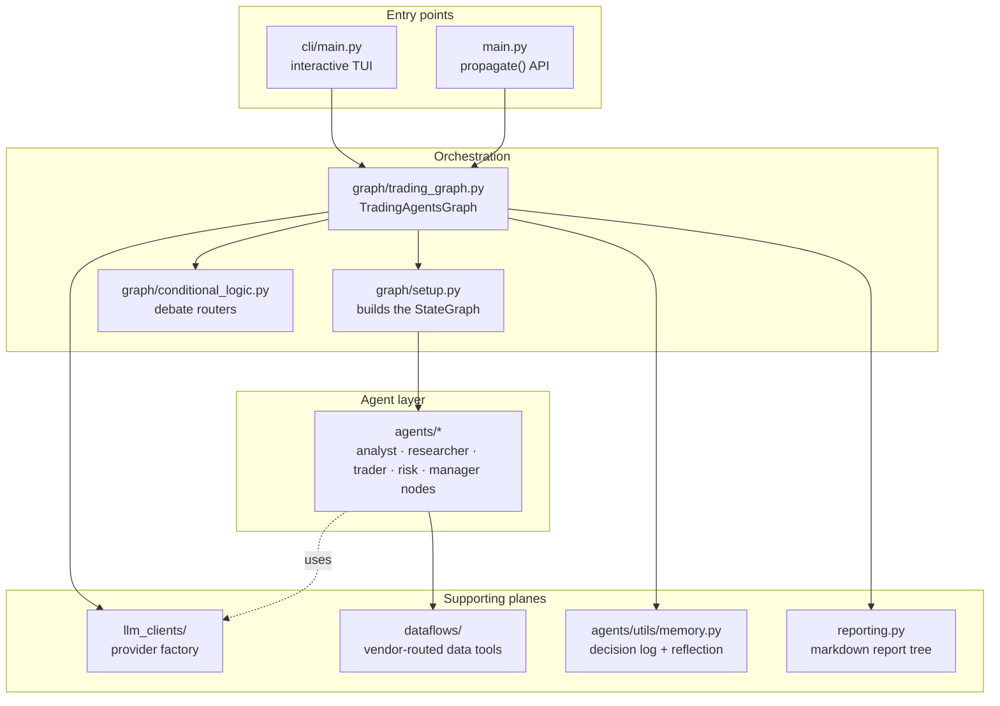
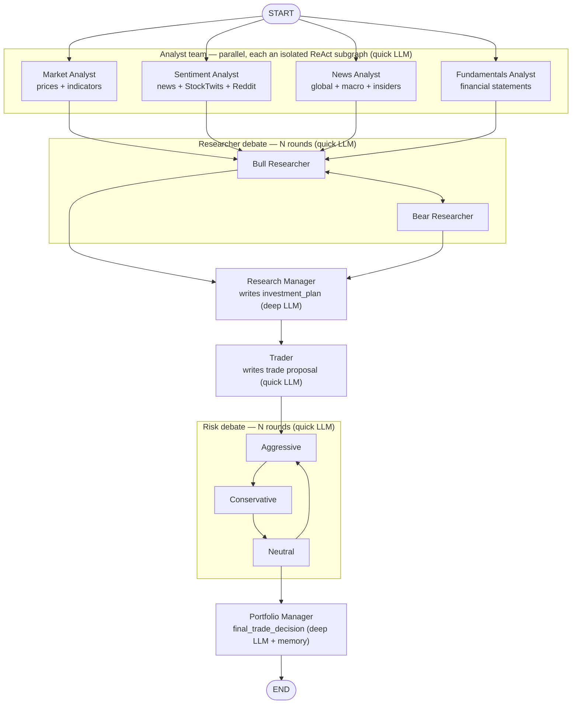
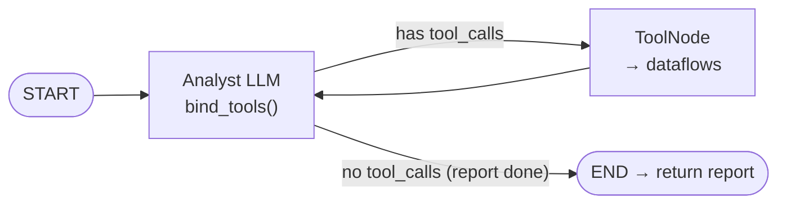
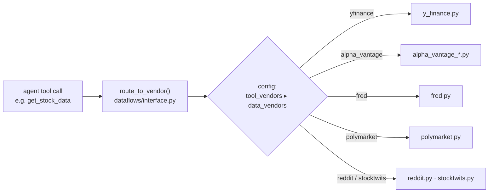
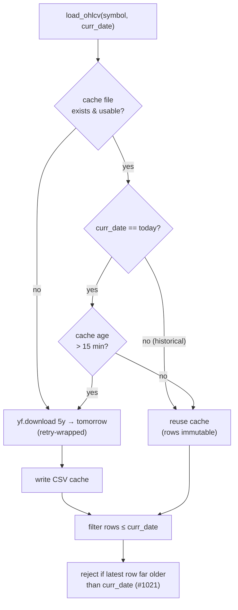
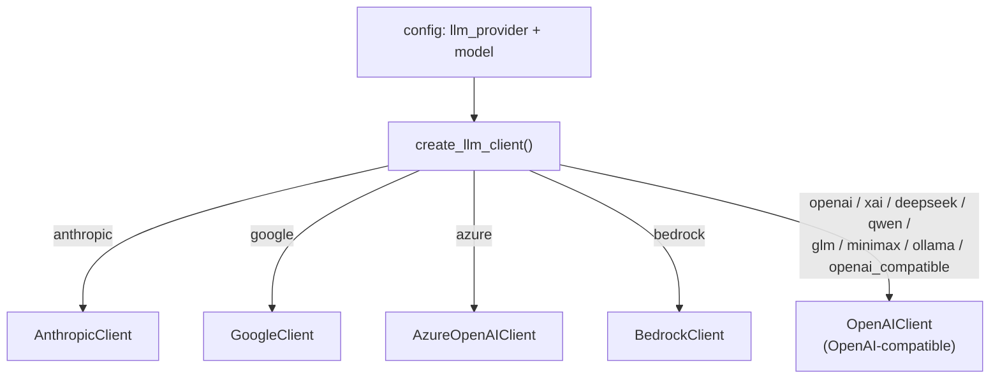
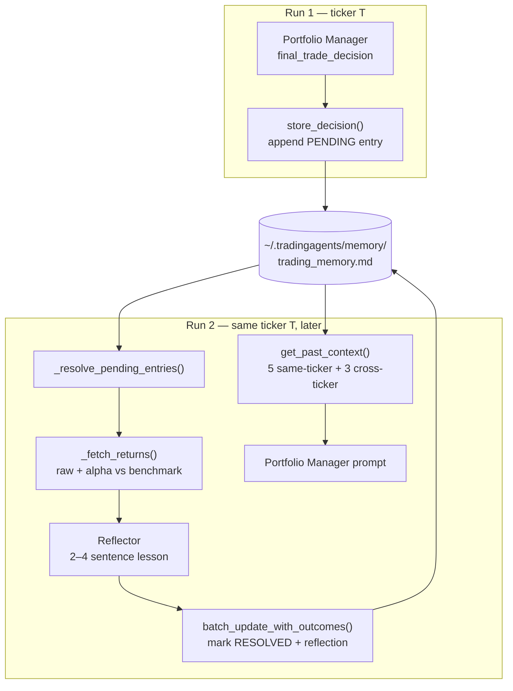

# TradingAgents — Architecture & Codebase Guide

A map of how the framework is put together: the layers, the agent pipeline,
the data plane, the LLM abstraction, and the memory loop. Diagrams are
[Mermaid](https://mermaid.js.org/) and render directly on GitHub.

---

## 1. What it is, in one paragraph

TradingAgents turns a `(ticker, date)` pair into a trade decision by running a
team of LLM agents that mirror a real trading desk: four **analysts** gather
data, two **researchers** debate bull vs. bear, a **trader** drafts a
proposal, a three-way **risk team** stress-tests it, and a **portfolio
manager** issues the final call. The whole team is wired as a single
[LangGraph](https://langchain-ai.github.io/langgraph/) state machine. Each run
also feeds a persistent **memory log** so later runs learn from the realized
outcome of earlier ones.

---

## 2. Layered architecture



| Layer | Where | Responsibility |
|---|---|---|
| Entry points | `cli/`, `main.py` | Collect inputs (ticker, date, models, depth); stream progress |
| Orchestration | `tradingagents/graph/` | Build & run the LangGraph, route debates, manage checkpoints |
| Agent layer | `tradingagents/agents/` | The actual LLM nodes and their prompts/tools |
| LLM plane | `tradingagents/llm_clients/` | One interface over OpenAI, Anthropic, Google, Bedrock, … |
| Data plane | `tradingagents/dataflows/` | Fetch prices, fundamentals, news, macro; vendor routing |
| Memory | `agents/utils/memory.py` + `graph/reflection.py` | Persist decisions, reflect on outcomes, re-inject lessons |
| Reporting | `reporting.py` | Write the on-disk markdown report tree |

---

## 3. The agent pipeline (the heart of it)

This is what `propagate()` actually runs. Analysts run **concurrently**
(fan-out/fan-in); everything after the debate is sequential.



**Stage flow & control:**

| Stage | Nodes | Loop / stop condition | LLM tier |
|---|---|---|---|
| Analysts | Market, Sentiment, News, Fundamentals | Each runs its own ReAct tool loop, then reports | quick |
| Researcher debate | Bull ⇄ Bear | stops at `count ≥ 2 × max_debate_rounds` (`conditional_logic.py:52`) | quick |
| Synthesis | Research Manager → Trader | single pass each | deep / quick |
| Risk debate | Aggressive → Conservative → Neutral | stops at `count ≥ 3 × max_risk_discuss_rounds` (`conditional_logic.py:63`) | quick |
| Final | Portfolio Manager | single pass; only node that reads memory | deep |

> **quick vs deep** = the two models you pick (`quick_think_llm`,
> `deep_think_llm`). Wiring is in `graph/setup.py`; only the two managers use
> the deep model.

### 3a. Inside one analyst (ReAct subgraph)

Each analyst is a self-contained subgraph with a **private `messages`
channel**, so the four can run at once without clobbering each other's tool
scratchpad. Only its `*_report` field crosses back to the parent graph.



Defined in `graph/analyst_subgraph.py`; wired via fan-out/fan-in in
`graph/setup.py`. (The Sentiment Analyst is the exception — it pre-fetches its
data and uses structured output instead of a tool loop.)

---

## 4. Shared state (`AgentState`)

Every node reads and writes one shared `TypedDict` (`agents/utils/agent_states.py`).
Nodes communicate through **fields**, not direct calls.

```mermaid
flowchart LR
  subgraph inputs [Set at run start]
    A1["company_of_interest"]
    A2["trade_date"]
    A3["instrument_context<br/>(resolved identity)"]
    A4["past_context<br/>(memory lessons)"]
  end
  subgraph reports [Written by analysts]
    B1["market_report"]
    B2["sentiment_report"]
    B3["news_report"]
    B4["fundamentals_report"]
  end
  subgraph debates [Written by teams]
    C1["investment_debate_state<br/>(bull/bear history, count)"]
    C2["investment_plan"]
    C3["trader_investment_plan"]
    C4["risk_debate_state"]
    C5["final_trade_decision"]
  end
  inputs --> reports --> debates
```



Two nested sub-states carry the debates: `InvestDebateState` (bull/bear) and
`RiskDebateState` (aggressive/conservative/neutral). Their `count` field is
what the routers in `conditional_logic.py` check to end each debate.

---

## 5. Data plane — vendor routing

Agent tools never call an API directly. They call an abstract tool
(`get_stock_data`, `get_news`, …) which is **routed to a configured vendor**
with ordered fallback. The configured chain *is* the chain — no silent
fallback to a vendor you didn't pick.



| Category (config key) | Options | Default |
|---|---|---|
| `core_stock_apis` | yfinance, alpha_vantage | yfinance |
| `technical_indicators` | yfinance, alpha_vantage | yfinance |
| `fundamental_data` | yfinance, alpha_vantage | yfinance |
| `news_data` | yfinance, alpha_vantage | yfinance |
| `macro_data` | fred | fred |
| `prediction_markets` | polymarket | polymarket |

Set per-category in `data_vendors` or override a single tool in `tool_vendors`
(`default_config.py`). Fallback: list several, e.g. `"yfinance,alpha_vantage"`.
The configured chain **is** the chain — it never silently falls back to a
vendor you didn't pick (#988/#289). `macro_data` and `prediction_markets` are
in `OPTIONAL_CATEGORIES`, so a failure there degrades gracefully; prices,
fundamentals, and news raise loudly.

### 5a. Sources & keys

| Data | Tool(s) | Vendors | API key |
|---|---|---|---|
| Prices (OHLCV) | `get_stock_data` | yfinance, alpha_vantage | yfinance: none · AV: `ALPHA_VANTAGE_API_KEY` |
| Technical indicators | `get_indicators` | yfinance (stockstats), alpha_vantage | same |
| Fundamentals / statements | `get_fundamentals`, `get_balance_sheet`, `get_cashflow`, `get_income_statement` | yfinance, alpha_vantage | same |
| Ticker & global news | `get_news`, `get_global_news` | yfinance, alpha_vantage | same |
| Insider transactions | `get_insider_transactions` | alpha_vantage, yfinance | same |
| Macro (CPI, rates, …) | `get_macro_indicators` | FRED | `FRED_API_KEY` |
| Prediction markets | `get_prediction_markets` | Polymarket | none |
| Social sentiment | pre-fetched by Sentiment Analyst | Reddit + StockTwits | none |

### 5b. Freshness — how "latest" is pulled

Two dates drive every fetch:

- **`trade_date`** (analysis date) = a **look-ahead cap**. After fetching, rows
  are filtered to `Date <= curr_date` (`stockstats_utils.py:215`), so a
  backtest never sees future prices.
- **"today"** = when `trade_date` is the current day, the fetch reaches the
  live bar. Yahoo publishes a *partial* daily candle during market hours whose
  `Close` is not final — so a same-day cache must expire.



- Same-day TTL = **900 s** (`OHLCV_CACHE_TTL_SECONDS`); historical rows are
  immutable and reused forever.
- `end` is requested as **tomorrow** (yfinance `end` is exclusive) so today's
  row is included (#986).
- A stale frame (newest row far older than `curr_date`) is rejected rather than
  fed into indicators (#1021).

### 5c. Storage & caching

**Only OHLCV price data is cached to disk.** News, fundamentals, macro,
insider, social, and prediction-market data are **fetched live every run** —
look-ahead is enforced by date-filtering the API response
(`alpha_vantage_common.py:142`), not by a cache.

| What | Cached? | Where | Invalidation |
|---|---|---|---|
| OHLCV prices | ✅ per-symbol CSV | `~/.tradingagents/cache/<SYM>-YFin-data-<start>-<end>.csv` | 15-min TTL same-day; empty/corrupt = miss → refetch |
| News / fundamentals / macro / social | ❌ live | — | — |
| Decision memory | ✅ append-only markdown | `~/.tradingagents/memory/trading_memory.md` | rotation by max-entries |
| Checkpoints (opt-in) | ✅ SQLite | `~/.tradingagents/cache/checkpoints/<SYM>.db` | cleared on success |

- Cache root is `data_cache_dir`, overridable with `TRADINGAGENTS_CACHE_DIR`.
- The OHLCV cache is a **fixed 5-year window per symbol**, so all date ranges
  for one ticker share one file.
- All symbols pass through `normalize_symbol` (broker/forex → Yahoo, e.g.
  `XAUUSD → GC=F`) and `safe_ticker_component` (path-traversal hardening) before
  touching the filesystem.
- A failed price fetch never writes an empty frame, so the cache can't be
  poisoned.
- Because non-price sources aren't cached, two runs minutes apart can see
  different news/social content — the documented reproducibility caveat.

---

## 6. LLM plane — provider abstraction

One factory (`llm_clients/factory.py`) returns a provider client behind a
common `get_llm()` interface, so the graph never hard-codes a provider.



- Any OpenAI-compatible endpoint (vLLM, LM Studio, Ollama, custom relay) flows
  through `OpenAIClient` — see `is_openai_compatible()`.
- `model_catalog.py` / `capabilities.py` know which models support reasoning
  effort, thinking level, temperature, etc.; `validators.py` warns on unknown
  model IDs.

---

## 7. Memory & reflection loop

The one part that spans **runs**. A decision is logged as `pending`, then the
*next* run for the same ticker resolves it against realized returns, writes a
short lesson, and re-injects recent lessons into the Portfolio Manager.



- **Producer:** `graph/reflection.py` (`Reflector`) — writes the lesson text.
- **Store:** `agents/utils/memory.py` (`TradingMemoryLog`) — append-only
  markdown, atomic writes, optional rotation.
- **Consumer:** only the Portfolio Manager prompt reads `past_context`.
- Realized-return math (`_fetch_returns`, `_resolve_benchmark`) lives in
  `graph/trading_graph.py`; benchmark auto-selects by exchange suffix (SPY for
  US, `^N225` for Tokyo, etc.).

---

## 8. Persistence & recovery

| Concern | Mechanism | Location |
|---|---|---|
| Decision memory | append-only markdown log (always on) | `~/.tradingagents/memory/trading_memory.md` |
| Crash resume | opt-in LangGraph SqliteSaver per ticker (`--checkpoint`) | `~/.tradingagents/cache/checkpoints/<TICKER>.db` |
| Reports | markdown tree per run | `~/.tradingagents/logs/` (via `reporting.py`) |
| Run state dump | full JSON state per run | `results_dir/<ticker>/TradingAgentsStrategy_logs/` |

Checkpoint identity is keyed on ticker + date + **graph shape** (analyst
selection, debate depths, asset type) so a resume never continues a
differently-shaped graph (`_run_signature`, `trading_graph.py`).

---

## 9. Directory map (where to look)

```
tradingagents/
├── graph/                     # orchestration
│   ├── trading_graph.py       #   TradingAgentsGraph — main entry, run loop, memory wiring
│   ├── setup.py               #   builds the StateGraph (fan-out/fan-in wiring)
│   ├── analyst_subgraph.py    #   isolated per-analyst ReAct subgraph (parallelism)
│   ├── analyst_execution.py   #   analyst node specs + wall-time tracking
│   ├── conditional_logic.py   #   debate/risk routers (stop conditions)
│   ├── propagation.py         #   initial state construction
│   ├── reflection.py          #   Reflector — post-outcome lessons
│   ├── signal_processing.py   #   extract 5-tier rating from PM decision
│   └── checkpointer.py        #   SqliteSaver lifecycle
├── agents/
│   ├── analysts/              # market, sentiment, news, fundamentals
│   ├── researchers/           # bull, bear
│   ├── managers/              # research_manager, portfolio_manager
│   ├── risk_mgmt/             # aggressive, conservative, neutral
│   ├── trader/                # trader
│   ├── schemas.py             # structured-output pydantic schemas
│   └── utils/                 # agent_states, memory, agent_utils, tools, structured
├── dataflows/                 # data plane: vendor impls + interface router
├── llm_clients/               # provider factory + per-provider clients + catalog
├── default_config.py          # single source of config + env-var overrides
└── reporting.py               # markdown report tree writer
cli/                           # interactive TUI (questionary + rich)
main.py                        # minimal programmatic example
```

---

## 10. Two mental models to keep

1. **Nodes talk through state, not to each other.** An agent writes a field
   (`market_report`, `investment_plan`, …); the next agent reads it. To trace
   any behavior, follow the field, not a call stack.

2. **Two config knobs shape a run:** the **graph shape** (which analysts,
   debate/risk depth, asset type) and the **model tiers** (quick vs deep).
   Everything else — providers, data vendors, language, temperature — is
   swappable config in `default_config.py` and `TRADINGAGENTS_*` env vars.
```
