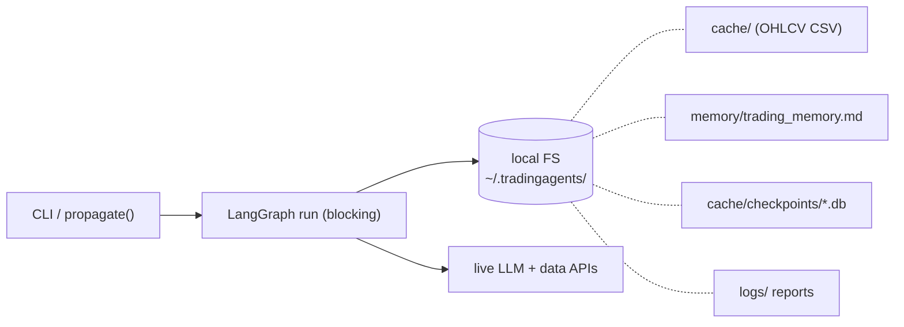
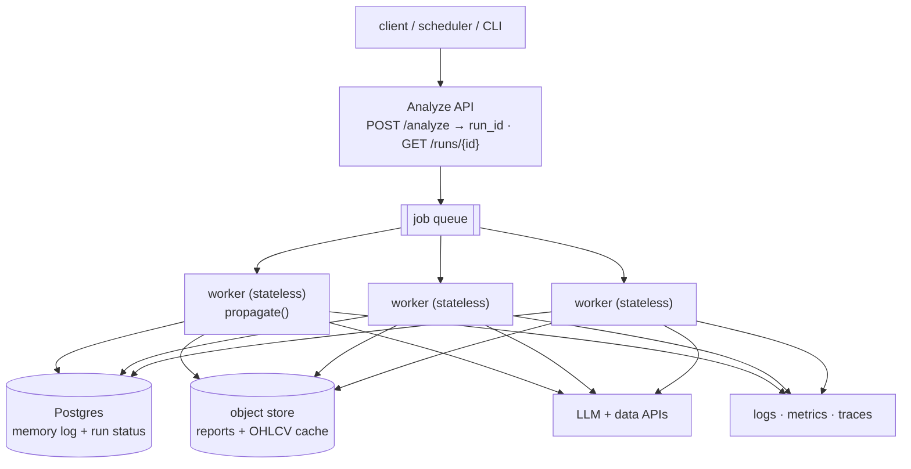
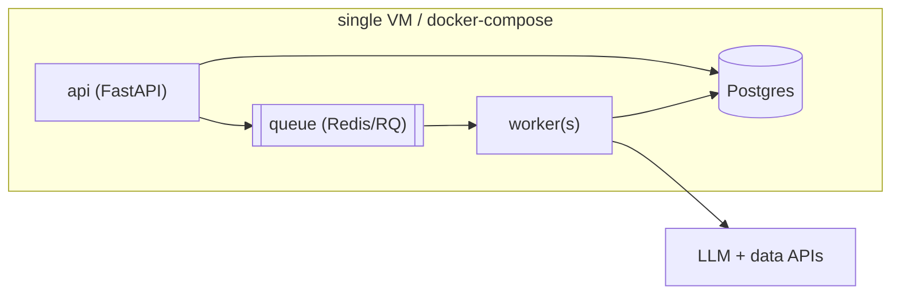

# Scalability, Deployment & Monitoring — DRAFT Proposal (thin-first)

> Status: **draft**. Scope: turn the current single-process CLI/library into a
> horizontally-scalable service **with the smallest viable change first**, then
> layer on hardening. Every phase past Phase 0 is deferred until its trigger is
> hit — no speculative platform-building.

---

## 1. Where we are (the constraints that block scale)

TradingAgents today is a **single-process, single-run** app: `propagate(ticker,
date)` runs one analysis, blocking, and all state lives on the **local
filesystem** under `~/.tradingagents/`.

What this blocks:

| # | Constraint | Why it blocks scale |
|---|---|---|
| 1 | `propagate()` is synchronous, one run per process | No concurrency across tickers; no back-pressure |
| 2 | State on local FS | Can't run >1 instance safely; state not shared/durable |
| 3 | `trading_memory.md` = single markdown file | Cross-process writes race; the shared learning state has no real store |
| 4 | Checkpoints = per-ticker SQLite, local | Resume dies if the worker/host dies |
| 5 | No service boundary | Nothing to call, schedule, or autoscale |
| 6 | No global rate-limit / cost budget | N concurrent runs → provider 429s and runaway spend |
| 7 | Observability is per-run only (CLI stream, `stats_handler`) | Nothing aggregated, exported, or alertable |

**Not a constraint:** intra-run analyst latency — already fixed by the parallel
analyst subgraphs (`graph/analyst_subgraph.py`).

---

## 2. Target design (thin scalable core)

Smallest architecture that unlocks horizontal scale: a **thin API** that
enqueues jobs, **stateless workers** that run the graph, and **shared stores**
for the state that must outlive a single worker.

**Design rules (keep it thin):**
- Workers are **stateless** — all durable state goes to shared stores, so you
  scale by adding workers.
- Only move to a shared store what **must** be shared. Prices are cheap to
  refetch, so per-worker local OHLCV cache is fine at first (see gap table).
- Reuse what exists: the config layer, Dockerfile, and `propagate()` API stay;
  we wrap, not rewrite.

---

## 3. Component gaps — today → needed → when

| Component | Today | Needed for scale | Phase |
|---|---|---|---|
| **Execution** | blocking `propagate()` | thin API + queue + stateless workers | **0** |
| **Memory log** (shared learning) | single `.md` file, atomic write | Postgres table (row per decision), safe concurrent writes | **0** |
| **Run status/results index** | JSON dumped to FS | Postgres `runs` table (id, ticker, date, status, cost) | **0** |
| **Reports/artifacts** | local `logs/` tree | object store (S3/GCS) keyed by run_id | **1** |
| **OHLCV cache** | local CSV per symbol | keep local per-worker first → shared cache (S3/Redis) only if refetch cost bites | **2** |
| **Checkpoints** | local per-ticker SQLite | LangGraph Postgres checkpointer (survives worker restart) — only if long runs must resume | **2** |
| **Rate limit / cost budget** | per-run SDK retries | shared token-bucket + per-provider daily $ cap (Redis) | **1** |
| **Secrets** | env vars / `.env` | secret manager injected as env | **0/1** |
| **Config** | dict + `TRADINGAGENTS_*` env | unchanged — already container-friendly | — |

> **Deferred on purpose:** shared OHLCV cache and the Postgres checkpointer are
> Phase 2. Prices refetch cheaply and most runs finish without interruption —
> adding a shared cache/checkpointer before that hurts is complexity for its
> own sake. Add when refetch cost or restart-loss is measured.

---

## 4. Deployment — core & thin first

### Phase 0 — one host, real service (days)
The thinnest deployable slice. Reuses the existing `Dockerfile` /
`docker-compose.yml`.

- Add a ~100-line FastAPI wrapper: `POST /analyze` enqueues, `GET /runs/{id}`
  reads status from Postgres. Worker = existing `propagate()` in a loop over the
  queue.
- One `docker compose up`: `api`, `worker` (scale with `--scale worker=N`),
  `postgres`, `redis`.
- **Deliverable:** submit many tickers, they process concurrently, results and
  memory are durable and shared. This alone covers most real usage.

### Phase 1 — managed & horizontal (when one host isn't enough)
- Workers → autoscaling containers (**ECS Fargate** or **K8s**; you have AWS
  tooling). API behind a load balancer.
- Postgres → **RDS**; Redis → **ElastiCache**; reports → **S3**.
- Queue → keep Redis/RQ, or **SQS** if you want managed + DLQ.
- Add the shared rate-limiter + per-provider cost cap here (concurrency makes it
  necessary).

### Phase 2 — harden (only if scale/SLA demands)
- Dead-letter queue + ret/replay, shared OHLCV cache, Postgres checkpointer,
  per-tenant isolation, multi-AZ.

> **Alternative stack:** if you'd rather stay in the Databricks ecosystem, the
> same shape maps to a Databricks App (API) + Jobs (workers) + Lakebase/Postgres
> (state) + Unity Catalog volumes (artifacts). Pick one target before Phase 1.

---

## 5. Monitoring — core & thin first

### Phase 0 — see cost, failures, and traces (the non-negotiable core)
- **Structured JSON logs**, one event per run with: `run_id`, `ticker`, `date`,
  `phase`, `tokens_in/out`, `usd_cost`, `latency_ms`, `status`. Wire the existing
  `callbacks` / `stats_handler` hook to emit these — the token/cost data already
  exists per run, it just isn't exported.
- **LangSmith tracing** — near-free: set `LANGCHAIN_TRACING_V2` + API key; every
  node/LLM/tool call becomes a trace. Best single win for debugging agent runs.
- **Health endpoint** on the API (`/healthz`) + queue depth logged.

| Signal | Phase 0 source |
|---|---|
| Cost per run / per day | log field `usd_cost`, summed |
| Failures & where | `status` + `phase` in logs; LangSmith trace |
| Latency | `latency_ms` per run |
| Provider throttling (429s) | logged from SDK retry events |

### Phase 1 — metrics & alerts
- Export metrics (Prometheus / CloudWatch): throughput, p95 latency, error rate,
  cost/run, queue depth, 429 rate.
- One dashboard (Grafana / CloudWatch) + **alerts** on: error rate > X%, daily
  cost > budget, queue depth backing up.

### Phase 2 — SLOs & drift
- Trace propagation across the queue (OTel), cost/anomaly alerts, decision-drift
  monitoring against realized alpha (the memory log already computes it).

---

## 6. Roadmap at a glance

| Phase | Design | Deploy | Monitor | Trigger to start |
|---|---|---|---|---|
| **0 (thin core)** | API + queue + stateless workers; memory & run-status in Postgres | docker-compose on one host | JSON logs + cost + LangSmith + healthz | now |
| **1** | + shared rate-limit/cost cap; artifacts in object store | managed containers + RDS/Redis/S3 | metrics dashboard + alerts | one host saturated |
| **2** | + shared cache, Postgres checkpointer, DLQ, isolation | autoscale, multi-AZ | SLOs, drift/anomaly alerts | SLA / multi-tenant demand |

**Do first (Phase 0), in order:** (1) Postgres-back the memory log + a `runs`
table, (2) thin FastAPI + queue + worker around `propagate()`, (3) structured
cost/latency logs + LangSmith. That's the whole scalable core; everything else
waits for a measured trigger.
