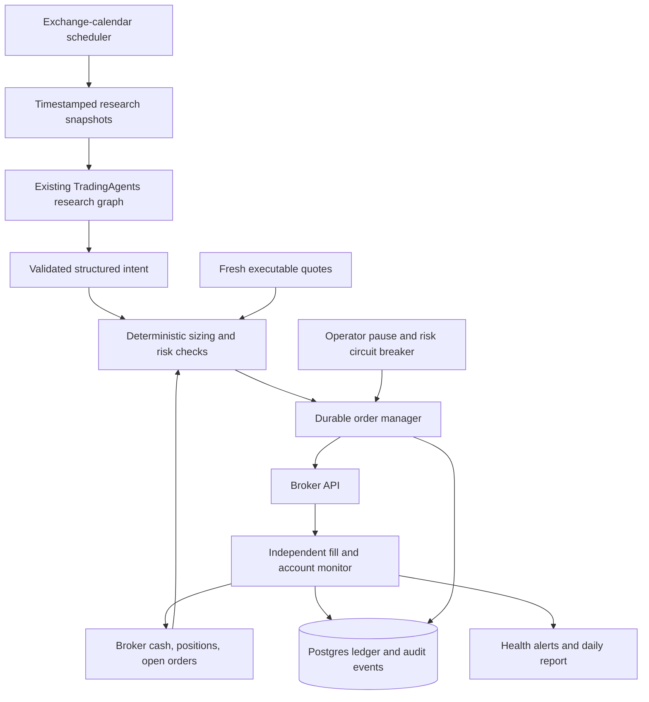

# Proposal: autonomous trading with TradingAgents

**Decision:** build a daily US stock trading service around the existing research agents, with deterministic portfolio controls and broker execution. Start in paper trading; enable limited live trading only after operational and strategy validation.

**Prepared:** 20 September 2026 · **Code reviewed:** `c3c7ec2` · **Status:** proposal for review, not an implemented trading system.

## 1. Choose a narrow first market

| Priority   | Target                      | Initial scope                                                                                                                                                           | Why it fits this project                                                                           |
| ---------- | --------------------------- | ----------------------------------------------------------------------------------------------------------------------------------------------------------------------- | -------------------------------------------------------------------------------------------------- |
| **First**  | Liquid US large-cap stocks  | Research 5–10 approved stocks across at least three sectors; hold at most five positions; long-only, cash-funded exposure; one scheduled decision cycle per trading day | Reuses the existing company fundamentals, news, sentiment, technical analysis, and debate workflow |
| **Second** | Broad-market US equity ETFs | Add one or two approved, unleveraged funds after the stock pilot passes; use the same broker and execution service                                                      | Reuses market data and execution, but needs ETF-specific research and overlap controls             |

This is a recommendation about engineering fit, not a claim that these markets or the current agents will generate superior returns. The first research hypothesis is that the agents improve entry, reduction, and exit decisions over a simple daily strategy after costs.

Use a **multi-day holding horizon**, initially evaluated over 5–20 trading sessions. Start with whole shares and regular-session trading. The approved universe should have reliable data, a proposed trailing 30-session average dollar volume above $100 million, and broker-confirmed tradability. Freeze and version the universe for each evaluation period. Instrument examples are test candidates, not buy recommendations.

ETFs need a separate research profile: fund holdings, concentration, liquidity, tracking behavior, and macro exposure replace company income-statement analysis. Include holdings overlap with existing stock positions. Do not treat two overlapping index funds as independent diversification.

### Broker choice

**Proposed first adapter: Alpaca Trading API**, using paper mode throughout development. Its paper environment supports the same API specification with separate credentials and endpoint; paper-only accounts are available globally. This makes it a practical starting point for integration. [Alpaca paper trading](https://docs.alpaca.markets/us/docs/paper-trading)

Live-account access remains a dependency. Alpaca's current country-availability page directs applicants to support; public documentation does not establish this user's eligibility. Confirm residence, account eligibility, funding access, trading permissions, and data entitlements before committing to the live adapter. [Alpaca country availability](https://alpaca.markets/support/countries-alpaca-is-available)

**Fallback: IBKR if account access requires it.** IBKR lists Vietnam among available countries, although that does not guarantee individual approval or funding eligibility. Its TWS API connects through TWS or IB Gateway, which adds session and gateway operations to the implementation. Build and validate one broker adapter first. If IBKR becomes the live choice, repeat integration and paper qualification there. [IBKR countries](https://www.interactivebrokers.com/en/accounts/open-account-country-list.php), [IBKR API documentation](https://www.interactivebrokers.com/docs)

## 2. What the repository already provides

The project is a useful research engine. It needs a separate execution and account-control system to become an autonomous trader.

| Existing capability                                        | Evidence in the repository                                                                                                                                   | Required extension                                                                                                         |
| ---------------------------------------------------------- | ------------------------------------------------------------------------------------------------------------------------------------------------------------ | -------------------------------------------------------------------------------------------------------------------------- |
| Multi-agent research and a final five-level rating         | [`TradingAgentsGraph.propagate()`](../tradingagents/graph/trading_graph.py), [`portfolio_manager.py`](../tradingagents/agents/managers/portfolio_manager.py) | Schedule runs and preserve a validated decision object for execution                                                       |
| Pydantic decision schemas                                  | [`schemas.py`](../tradingagents/agents/schemas.py), [`structured.py`](../tradingagents/agents/utils/structured.py)                                           | Current outputs are rendered to prose; structured failures can fall back to text. Live execution must reject that fallback |
| Data routing, freshness checks, and historical date guards | [`dataflows/`](../tradingagents/dataflows/), [`stockstats_utils.py`](../tradingagents/dataflows/stockstats_utils.py)                                         | Add execution quotes, publication-aware snapshots, exchange calendars, and broker instrument identity                      |
| Memory, reports, and optional analysis checkpoints         | [`memory.py`](../tradingagents/agents/utils/memory.py), [`checkpointer.py`](../tradingagents/graph/checkpointer.py)                                          | Add a durable order/fill ledger, portfolio accounting, reconciliation, and fill-based outcomes                             |
| CLI, Docker packaging, and a scalability proposal          | [`docker-compose.yml`](../docker-compose.yml), [`SCALABILITY_PROPOSAL.md`](SCALABILITY_PROPOSAL.md)                                                          | Add an unattended runner and independently supervised execution monitor                                                    |

Five findings shape the design:

1. **A rating is not an order.** `propagate()` returns Buy / Overweight / Hold / Underweight / Sell, or `REVIEW`. It does not submit orders or calculate account-aware quantities. `position_sizing` is currently optional text.
2. **The risk debate has no hard account limits.** The reviewed shared state does not carry broker cash, positions, outstanding orders, or account exposure. LLM agreement cannot enforce those constraints.
3. **Current reflection measures a price proxy.** `_fetch_returns()` compares price changes over a default five-session window against a benchmark. It does not account for actual fills, position size, partial exits, fees, or unused capital.
4. **Historical date filtering is incomplete evidence of historical availability.** `filter_financials_by_date()` filters statement columns by fiscal period end, not filing/publication time. That can expose information before it was public. Existing news, social, macro, and memory safeguards are valuable but do not establish complete point-in-time reproducibility.
5. **Research symbols are not broker contracts.** `symbol_utils.py` includes proxy mappings such as `XAUUSD` to `GC=F`. Execution must use verified asset identifiers, exchange, currency, and instrument type; a research alias must never silently choose a tradable contract.

No functioning broker adapter, account-level order manager, or autonomous scheduling loop was found in the inspected application code. A `backtrader` dependency is present; that alone is not a validated portfolio backtest.

## 3. Proposed system

### Design choice

| Approach                                                              | Benefit                                                                                   | Decision                                                              |
| --------------------------------------------------------------------- | ----------------------------------------------------------------------------------------- | --------------------------------------------------------------------- |
| **Existing agents + deterministic trading service**                   | Preserves the project's research value while making money movement independently testable | **Recommended**                                                       |
| Agents produce research; a simple rules strategy alone selects trades | Easier to evaluate and operate, with less use of the agents' decisions                    | Implement as the comparison baseline; choose it if it performs better |
| Broader agent autonomy, including order management and policy changes | More flexibility but harder to reproduce and constrain                                    | Outside the initial scope                                             |

**Autonomy means:** the service researches, decides, sizes, submits, monitors, and reports on schedule within an approved policy. Routine qualifying orders need no per-order approval. Capital increases, policy/model changes, new instruments, recovery from serious incidents, and the first activation of live mode remain operator decisions

### A. Preserve typed decisions

Retain the existing readable reports and CLI interface. Add a strict machine interface carrying:

| Record              | Required contents                                                                                                                                         |
| ------------------- | --------------------------------------------------------------------------------------------------------------------------------------------------------- |
| `ResearchDecision`  | Run ID, canonical asset ID, final rating, evidence references, data cutoff, creation time, expiry, proposed stop, thesis, schema/model/prompt versions    |
| `PortfolioSnapshot` | Account and environment, equity, available cash, positions, outstanding orders, reservations, timestamp and version                                       |
| `OrderIntent`       | Intent ID, decision reference, target quantity, delta quantity, side, permitted order type, price bounds, protection instructions, expiry, policy version |
| `ExecutionRecord`   | Client and broker order IDs, lifecycle state, fills and corrections, fees, event times, reconciliation results                                            |

Financial values use fixed-precision decimals. Validate positive finite prices, whole-share increments, asset identity, evidence completeness, and stop geometry. No parsing of prose into executable quantities. Missing required fields, an expired intent, `REVIEW`, unsupported structured output, or a provider timeout produce **no new exposure** and a recorded reason.

The policy translates ratings into targets. A concrete hypothesis for paper evaluation is: Buy targets up to 5% of strategy equity; Overweight up to 2.5%; Hold preserves current quantity; Underweight halves current quantity; Sell targets zero. Caps and stop-based sizing can lower these targets. A repeated Buy therefore moves toward a target instead of purchasing another allocation every day. An absent position plus Sell cannot become a short. Risk exits override Hold.

Do not interpret a model's confidence score as a calibrated probability. Freeze this mapping before evaluating it; promotion requires evidence, not a plausible explanation.

### B. Enforce portfolio policy in code

Use a dedicated account or separately identifiable strategy allocation. All percentages below refer to that allocation's equity. These are **proposed paper-pilot limits**, not personalized capital recommendations; the actual live capital and acceptable loss must be set before activation.

| Policy                      | Proposed starting setting                                                                                                                                                                                       |
| --------------------------- | --------------------------------------------------------------------------------------------------------------------------------------------------------------------------------------------------------------- |
| Exposure                    | Long-only; no borrowing; maximum 5% per stock, 10% per sector, 25% total gross exposure, five positions                                                                                                         |
| Loss controls               | Planned stop-distance risk no more than 0.25% per position; pause new risk at 1% daily equity loss or 3% drawdown from the allocation's high-water mark                                                         |
| Entry quality               | Fresh consolidated quote no older than 2 seconds and broker snapshot no older than 10 seconds; spread at most 10 basis points; skip if price moved more than 1% from the decision's reference price             |
| Event and turnover controls | No new single-stock exposure from two trading sessions before scheduled earnings until one full session after; unknown earnings dates block entries; at most one discretionary target change per symbol per day |
| Operating limits            | Approved universe and regular session only; bounded retries; proposed $5 daily inference cap; loss-limit resume requires operator review                                                                        |

Compute daily loss from prior-session closing equity, adjusting for deposits and withdrawals; include unrealized losses and fees. Persist the high-water mark across restarts. Include existing orders and reserved funds in every exposure check. Revalidate under a per-account lock immediately before submission so several individually valid decisions cannot collectively exceed the limits. If sector classification is unknown, reject new exposure.

For a new long position, quantity is the whole-share minimum allowed by stop-distance risk, symbol/sector/portfolio headroom, available cash, and the proposed target. For example, with illustrative equity of $10,000, an entry at$100, and a stop at $97, the risk allowance permits eight shares, but a 5% symbol cap permits only five. The planned stop-distance loss is$15 before costs and gaps. Existing exposure and pending orders reduce headroom further.

A stop is not a guaranteed maximum loss; gaps and execution can exceed it. Alpaca documents that a triggered stop becomes a market order and does not guarantee its fill price. Protective-order behavior must be tested for the selected account and instrument. [Alpaca order semantics](https://docs.alpaca.markets/us/docs/orders-at-alpaca)

### C. Treat orders as a durable state machine

Track `CREATED → VALIDATED → SUBMITTING → ACKNOWLEDGED → PARTIALLY_FILLED → FILLED`, with explicit cancellation, rejection, expiry, and unknown-status paths. A cancel request is not a confirmed cancellation. Fills can race with cancels and replacements.

Persist the intent, fund reservation, and submission record before calling the broker. Use a stable client order ID and database uniqueness constraints for account, strategy, cycle, instrument, and revision. Alpaca allows orders to be tracked and retrieved using client order IDs. This supports reconciliation; it is not an end-to-end exactly-once guarantee. [Working with orders](https://docs.alpaca.markets/us/docs/working-with-orders)

If submission times out, query and reconcile before taking further action. Do not blindly resubmit. If acceptance cannot be established, pause that account's new orders until resolved. On restart, reconcile positions, cash, open orders, and recent executions before enabling submissions. Consume streaming updates plus periodic account snapshots; deduplicate events and handle out-of-order delivery and fill corrections.

Use bounded-price DAY limit orders for discretionary entries. Cancel unfilled remainder at the entry-window deadline and confirm its final state. Do not assume a marketable limit will fill. Maintain protective exits for the actual filled quantity; discretionary sells must coordinate with existing protective orders to avoid overselling.

Broker-native protection is preferred, but partial-fill behavior needs explicit handling. Alpaca documents that bracket exits activate after the entry is completely filled. A partially filled entry therefore needs a tested cancellation/protection procedure with a bounded unprotected interval. If the adapter cannot demonstrate it, that entry path cannot pass the live gate. [Alpaca bracket behavior](https://docs.alpaca.markets/us/docs/orders-at-alpaca)

**Pause** stops new risk and cancels risk-increasing orders while preserving protective exits. **Flatten** is a separate, deliberate liquidation operation. Never use “cancel all” as a generic outage response: it can remove protection. On lost connectivity, native broker protection remains in place; the service alerts and reconciles before resuming. Neither pause nor protective orders eliminate overnight gap risk.

### D. Run research daily; monitor execution independently

| Time in the exchange's timezone | Proposed operation                                                                                                                                   |
| ------------------------------- | ---------------------------------------------------------------------------------------------------------------------------------------------------- |
| 08:00–09:25 America/New\_York   | Reconcile, collect timestamped data, run the graph using completed prior-session daily bars and news available at the run cutoff                     |
| 10:00–10:30                     | Recheck market status, events, prices, positions, and limits; submit eligible target changes; expire unused intents at 10:30                         |
| During the session              | Process fills continuously; reconcile at least every 30 seconds; check protection, loss limits, and service health independently of LLM availability |
| After the actual session close  | Reconcile final state, calculate marked-to-market and realized P&amp;L, archive evidence, and produce a daily report                                 |

Use the broker's exchange calendar for holidays and shortened sessions. Store UTC timestamps; display the user's preferred timezone. Do not hard-code the US-to-Vietnam offset because daylight saving changes it. A missed entry window is skipped, not replayed later. Open-position protection and monitoring continue if research exceeds its deadline or spending cap.

Introduce separate cutoffs for completed price bars and currently available news/filings. The existing date-only `trade_date` is insufficient to express both. Capture these cutoffs in the input snapshot and carry them through each data tool so morning research cannot accidentally consume an unfinished daily candle or later-published information.

Before an entry, the planned stop and validated execution price must remain compatible. After a partial fill, recompute remaining allowance and protection. Time exits follow a fixed, versioned holding-period rule rather than a new LLM interpretation of the old thesis.

### E. Keep deployment small and isolate authority

Use one always-on host, Docker Compose, Postgres, a research runner, and a separately supervised execution/monitor process. Reuse current Python, LangGraph, Pydantic, reporting, and container packaging. Research initially runs sequentially across tickers to avoid sharing the graph instance's mutable state and markdown memory across workers. A durable database job table is sufficient initially; additional queues and horizontal research workers follow measured need.

Only the execution process receives broker trading credentials. Research receives market-data and model credentials, with bounded tools and no broker execution capability. External news and social content are untrusted inputs. Restrict execution to typed, policy-approved intents; exclude arbitrary code, arbitrary destinations, and withdrawal operations from its interface. Separate paper/live credentials, databases, account allowlists, and logs. Use broker-enforced permission restrictions where available.

Add an authenticated control interface for status, pause, and reviewed resume; keep direct broker access available for recovery. External heartbeat monitoring must detect a dead host. Back up the ledger, test restoration, redact secrets, and expose open positions, working orders, protection status, P&amp;L, data age, last reconciliation, and model spending. Suggested alerts: reconciliation mismatch, unknown order status, missing protection, loss breach, or heartbeat missing for 60 seconds.

Research checkpoints resume analysis only. They must never replay broker side effects. Pin the deployed model, prompt, policy, and dependency versions. Freeze an approved memory snapshot for each pilot version; quarantine new reflections so the existing automatic memory loop cannot silently alter its behavior. Promote candidate lessons through offline evaluation and a reviewed deployment. Keep hypothetical research outcomes separate from actual execution outcomes.

## 4. Delivery and acceptance

### Repository changes

These paths describe proposed work; they have not been implemented.

| Work package                       | Files and responsibilities                                                                                                                                                                                                                                    |
| ---------------------------------- | ------------------------------------------------------------------------------------------------------------------------------------------------------------------------------------------------------------------------------------------------------------- |
| Typed research boundary            | Modify `tradingagents/agents/schemas.py`, `agents/utils/structured.py`, `agents/utils/agent_states.py`, `agents/managers/portfolio_manager.py`, and `graph/trading_graph.py`; preserve typed output alongside reports and expose strict execution eligibility |
| Portfolio policy and broker access | Add `tradingagents/execution/models.py`, `policy.py`, `sizing.py`, `broker.py`, and `alpaca.py`; define the interface and build one qualified broker adapter                                                                                                  |
| Durable execution                  | Add `tradingagents/execution/order_manager.py`, `reconciliation.py`, `store.py`, and database migrations; own reservations, lifecycle events, fill accounting, and recovery                                                                                   |
| Unattended operation               | Add `tradingagents/runtime/scheduler.py`, `service.py`, and `monitoring.py`; extend `cli/main.py`, `tradingagents/default_config.py`, `tradingagents/reporting.py`, `pyproject.toml`, and `docker-compose.yml` for explicit runtime modes and controls        |
| Evaluation and regressions         | Add snapshot/replay support under `tradingagents/evaluation/` and behavior tests under `tests/execution/`; keep existing structured-output, symbol, point-in-time, and checkpoint tests passing                                                               |

### Five delivery stages

Estimates assume one experienced Python engineer, one broker, existing credentials, and no custom dashboard. **Budget 4–6 engineering weeks to a hardened paper service**, followed by **at least 20–30 trading sessions of qualification**. Allow roughly **8–12 calendar weeks before considering a small live pilot**; account access and insufficient strategy evidence can extend this.

| Stage                          | Deliverable and effort                                                                                                 | Acceptance gate                                                                                                                                         |
| ------------------------------ | ---------------------------------------------------------------------------------------------------------------------- | ------------------------------------------------------------------------------------------------------------------------------------------------------- |
| **1. Research contract**       | 3–5 engineering days: strict decisions, account/asset identity, snapshots, fixed policy, replay fixtures               | Malformed, expired, wrong-asset, missing-data, and `REVIEW` outputs produce zero executable intents; existing research interface remains usable         |
| **2. Complete paper cycle**    | 5–7 days: broker reads, sizing, ledger, submit/cancel, fill handling, actual P&amp;L                                   | A paper buy, partial fill, protected position, reduction, and exit reconcile against the broker; repeated scheduling does not create duplicate exposure |
| **3. Recovery and operations** | 7–10 days: failure injection, account locking, calendar, watchdog, spending controls, backup and restore               | Ambiguous submission, restart after acceptance, duplicate fill, cancel/fill race, stale quote, broker outage, and loss breach behave as specified       |
| **4. Qualification**           | 5–8 engineering days of evaluation work plus 20–30 live-market paper sessions                                          | Operational criteria below pass; a fixed strategy has sufficient forward/out-of-sample evidence after costs to justify the next experiment              |
| **5. Limited live pilot**      | One dedicated, explicitly capped allocation; observe at least another 20 trading sessions before considering expansion | Real fills, slippage, protection, costs, and drawdown remain within agreed limits; any scaling decision is reviewed                                     |

Stages 1–4 total 20–30 engineering days. Historical replay can begin earlier, but the paper qualification clock starts after the relevant implementation and policy are stable. Material strategy changes require a new forward evaluation period.

### Prove operations and strategy separately

**Operational gate:** zero unexplained position differences, zero duplicate submissions causing unintended exposure, no unresolved unknown orders, tested protection after partial fills, successful restore/reconciliation, and every submitted order traceable to a decision, snapshot, and policy version. Test failure scenarios explicitly; quiet paper trading will not exercise all of them.

**Strategy gate:** freeze universe, model, prompts, sizing, exit rules, and evaluation windows before running the experiment. Compare with cash, an exposure-matched broad-index allocation, and a simple deterministic strategy using the same universe, costs, and execution constraints. Report net return, maximum drawdown, risk-adjusted return, turnover, exposure, slippage, and outcome uncertainty. Evaluate model/data/hosting costs as well as trading costs. Continue paper observation if the sample is inconclusive; 20–30 sessions establish only a minimum operational observation period, not proof of profitability.

For historical evaluation, store when each input became available and when it was fetched. Include filing publication times, revisions, corporate actions, unavailable/delisted instruments, and the universe that existed at the time. Submit simulated orders only after the decision could have completed. Date filters cannot remove knowledge already present in an LLM's training data, so historical LLM results remain weaker evidence than a frozen prospective trial.

Paper results also have execution limitations. Alpaca explicitly excludes effects such as market impact, latency slippage, and queue position, and its simulator can fill quantities beyond displayed liquidity. Include conservative cost/liquidity assumptions in evaluation; use a small live pilot to measure actual execution differences. [Paper simulation limitations](https://docs.alpaca.markets/us/docs/paper-trading)

## 5. Cost, success, and the first milestone

### Operating budget

Estimate model costs from 20 representative recorded analysis runs before selecting a production model/debate depth. The starting formula is:

`monthly model cost = tickers × trading sessions × measured cost per complete run + retries/reflection`

For illustration, 10 tickers × 22 sessions × $0.10–$0.75 per run equals $22–$**165/month** before retry/reflection overhead. The per-run range is an assumption for budgeting, not a measured result or provider quote. Enforce the daily budget even if that requires analyzing fewer symbols.

| Cost category                                     | Planning allowance                                                                                                                                                                  |
| ------------------------------------------------- | ----------------------------------------------------------------------------------------------------------------------------------------------------------------------------------- |
| Host, database storage, backups, basic monitoring | $30–$80/month estimate; obtain an actual hosting quote before deployment                                                                                                            |
| LLM research                                      | Measure first; illustrative $22–$165/month before overhead, subject to the proposed daily cap                                                                                       |
| Execution market data                             | Alpaca currently lists Basic IEX-only data as free and Algo Trader Plus at $99/month with all-US-exchange coverage; budget consolidated real-time data for live quote/spread checks |
| Historical research data and trading costs        | Quote separately: point-in-time filings/news, commissions/fees, slippage, funding/FX charges, and taxes depend on services and account                                              |

The resulting illustrative recurring live-service allowance is approximately $150–$**350/month before extra historical data and trading costs**. The data price and feed distinctions above were checked against [Alpaca's market-data plans](https://docs.alpaca.markets/us/docs/about-market-data-api). IEX-only and consolidated quotes must not silently substitute for one another in qualification or execution.

Economics can invalidate an otherwise functioning system: a $200 monthly operating bill on a$10,000 allocation consumes 2% of that allocation each month before trading costs. The proposal does not assume an achievable return that offsets this. If the agents do not add measurable value after costs, retain the simpler baseline or keep the project as research software.

### First milestone

**Complete one recorded, repeatable paper cycle for one approved US stock: research → strict decision → account-aware size → broker order → confirmed fills and protection → reconciled ledger → daily report.**

Run the same cycle again and simulate a crash after broker acceptance; it must recover without adding unintended exposure. This is the smallest milestone that demonstrates the path toward autonomous live trading. Expand to the 5–10-stock research universe only after it passes.

Before any real-money activation, set the allocation amount and acceptable loss in currency, confirm live broker access, and approve the fixed deployment/policy version. Creating this proposal does not activate trading or authorize orders.